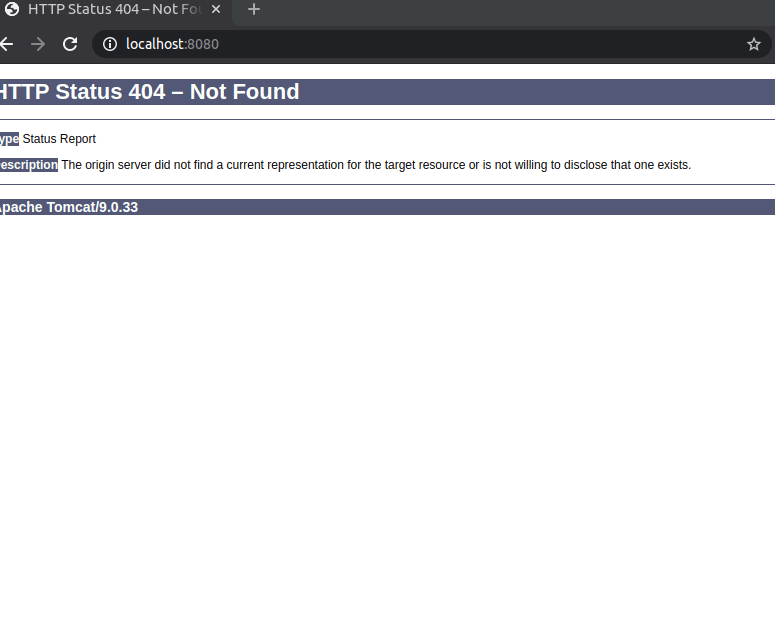

# BookAPI
## This is simple API for managing your list of Books
### Used HTTP methods:
* GET
* POST
* PUT
* DELETE
## In this app you can choose save your library in java code or save your books into .txt file.

